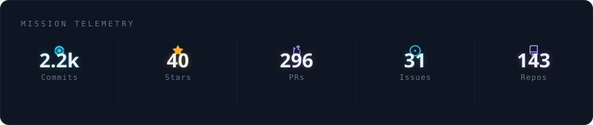

# Hi, I'm Blair Khan 👋

Building innovative solutions with code — I create scalable apps and systems across web and mobile.

- 🌍 Kampala, Uganda
- 🏫 Mountains of the Moon University
- 🔗 Portfolio: https://khanblair.github.io/portfolio/

## GitHub Streak

[](https://git.io/streak-stats)

## 🌌 Galaxy Profile

<div align="center">
  
</div>

<br/>

<div align="center">
  
</div>

<br/>

<div align="center">
  
</div>

<br/>

<div align="center">
  
</div>

<sub>Auto-generated every 12h by <a href="https://github.com/vinimlo/galaxy-profile">galaxy-profile</a> (GPL-3.0), configured in <a href="./config.yml">config.yml</a>.</sub>

## ⏱️ WakaTime Coding Activity

<!--START_SECTION:waka-->


**🐱 My GitHub Data** 

> 📦 1.6 MB Used in GitHub's Storage 
 > 
> 🏆 1,815 Contributions in the Year 2026
 > 
> 💼 Opted to Hire
 > 
> 📜 111 Public Repositories 
 > 
> 🔑 28 Private Repositories 
 > 
**I'm an Early 🐤** 

```text
🌞 Morning                2834 commits        ███████░░░░░░░░░░░░░░░░░░   26.79 % 
🌆 Daytime                5571 commits        █████████████░░░░░░░░░░░░   52.66 % 
🌃 Evening                1760 commits        ████░░░░░░░░░░░░░░░░░░░░░   16.64 % 
🌙 Night                  414 commits         █░░░░░░░░░░░░░░░░░░░░░░░░   03.91 % 
```
📅 **I'm Most Productive on Wednesday** 

```text
Monday                   2139 commits        █████░░░░░░░░░░░░░░░░░░░░   20.22 % 
Tuesday                  2117 commits        █████░░░░░░░░░░░░░░░░░░░░   20.01 % 
Wednesday                2322 commits        █████░░░░░░░░░░░░░░░░░░░░   21.95 % 
Thursday                 1593 commits        ████░░░░░░░░░░░░░░░░░░░░░   15.06 % 
Friday                   1655 commits        ████░░░░░░░░░░░░░░░░░░░░░   15.64 % 
Saturday                 323 commits         █░░░░░░░░░░░░░░░░░░░░░░░░   03.05 % 
Sunday                   430 commits         █░░░░░░░░░░░░░░░░░░░░░░░░   04.06 % 
```


📊 **This Week I Spent My Time On** 

```text
🕑︎ Time Zone: Africa/Kampala

💬 Programming Languages: 
TypeScript               34 hrs 9 mins       ███████████░░░░░░░░░░░░░░   42.95 % 
Other                    12 hrs 14 mins      ████░░░░░░░░░░░░░░░░░░░░░   15.39 % 
Python                   11 hrs 4 mins       ███░░░░░░░░░░░░░░░░░░░░░░   13.94 % 
Markdown                 6 hrs 50 mins       ██░░░░░░░░░░░░░░░░░░░░░░░   08.60 % 
JavaScript               3 hrs 14 mins       █░░░░░░░░░░░░░░░░░░░░░░░░   04.07 % 

🔥 Editors: 
Claude Code              39 hrs 9 mins       ████████████░░░░░░░░░░░░░   49.25 % 
Chrome                   32 hrs 23 mins      ██████████░░░░░░░░░░░░░░░   40.73 % 
Hermes                   2 hrs 25 mins       █░░░░░░░░░░░░░░░░░░░░░░░░   03.05 % 
VS Code                  1 hr 53 mins        █░░░░░░░░░░░░░░░░░░░░░░░░   02.39 % 
Discord                  1 hr 31 mins        ░░░░░░░░░░░░░░░░░░░░░░░░░   01.92 % 

🐱‍💻 Projects: 
kolaborate-monorepo      17 hrs 18 mins      █████░░░░░░░░░░░░░░░░░░░░   21.77 % 
tapestry                 11 hrs 23 mins      ████░░░░░░░░░░░░░░░░░░░░░   14.33 % 
NUNUFUND_FRONTEND-V_2    4 hrs 35 mins       █░░░░░░░░░░░░░░░░░░░░░░░░   05.78 % 
metamcp                  4 hrs 35 mins       █░░░░░░░░░░░░░░░░░░░░░░░░   05.78 % 
soundwave                4 hrs 25 mins       █░░░░░░░░░░░░░░░░░░░░░░░░   05.56 % 

💻 Operating System: 
Mac                      79 hrs 30 mins      █████████████████████████   100.00 % 
```

🤖 **AI Coding This Week** 

```text
⏱ AI Coding Time: 48 hrs 7 mins (60.53%)

✍️ 46,431 lines written by AI, 238 lines written by hand (99.49% AI-written)

🔤 42,205,867 Input Tokens, 8,912,450 Output Tokens

💵 $1049.18 Estimated AI Cost This Week

🧠 70 AI Sessions, 1195 AI Prompts

Sonnet                   46,742 lines        ████████████████████████░   96.53 % 
Hermes                   1,248 lines         █░░░░░░░░░░░░░░░░░░░░░░░░   02.58 % 
Opus                     429 lines           ░░░░░░░░░░░░░░░░░░░░░░░░░   00.89 % 
Claude                   5 lines             ░░░░░░░░░░░░░░░░░░░░░░░░░   00.01 % 
Github-Copilot           0 lines             ░░░░░░░░░░░░░░░░░░░░░░░░░   00.00 % 

🔎 AI Coding Insights:
🤖 AI-Driven — 99.49% of written lines came from AI
📚 Verbose Prompter — average 2,055 characters per prompt
🔁 Iterative Prompter — average 17 prompts per session
🚀 High AI Trust — 0.7% of changed lines were hand-edited
```

**I Mostly Code in TypeScript** 

```text
TypeScript               52 repos            ██████████░░░░░░░░░░░░░░░   40.62 % 
JavaScript               19 repos            ████░░░░░░░░░░░░░░░░░░░░░   14.84 % 
Python                   16 repos            ███░░░░░░░░░░░░░░░░░░░░░░   12.50 % 
Rust                     3 repos             █░░░░░░░░░░░░░░░░░░░░░░░░   02.34 % 
Kotlin                   2 repos             ░░░░░░░░░░░░░░░░░░░░░░░░░   01.56 % 
```


**Timeline**


 Last Updated on 03/09/2026 03:56:05 UTC
<!--END_SECTION:waka-->

## 📈 Extra WakaTime Insights

<!--START_SECTION:waka-extra-->


🗂️ **My Coding Categories (Last 7 Days)** 

```text
AI Coding                48 hrs 7 mins        ███████████████░░░░░░░░░░   60.53 % 
Browsing                 21 hrs 9 mins        ███████░░░░░░░░░░░░░░░░░░   26.61 % 
Coding                   8 hrs 24 mins        ███░░░░░░░░░░░░░░░░░░░░░░   10.58 % 
Code Reviewing           1 hr 44 mins         █░░░░░░░░░░░░░░░░░░░░░░░░   02.20 % 
Writing Tests            2 mins               ░░░░░░░░░░░░░░░░░░░░░░░░░   00.05 % 
Writing Docs             1 min                ░░░░░░░░░░░░░░░░░░░░░░░░░   00.04 % 
```

📚 **Libraries & Dependencies (Last 7 Days)** 

```text
react                    8 hrs 12 mins        █░░░░░░░░░░░░░░░░░░░░░░░░   04.13 % 
api                      6 hrs 53 mins        █░░░░░░░░░░░░░░░░░░░░░░░░   03.46 % 
tapestry                 4 hrs 57 mins        █░░░░░░░░░░░░░░░░░░░░░░░░   02.49 % 
lucide-react             4 hrs 54 mins        █░░░░░░░░░░░░░░░░░░░░░░░░   02.47 % 
button                   3 hrs 42 mins        ░░░░░░░░░░░░░░░░░░░░░░░░░   01.86 % 
navigation               3 hrs 24 mins        ░░░░░░░░░░░░░░░░░░░░░░░░░   01.71 % 
asyncio                  3 hrs 23 mins        ░░░░░░░░░░░░░░░░░░░░░░░░░   01.71 % 
langgraph                3 hrs 7 mins         ░░░░░░░░░░░░░░░░░░░░░░░░░   01.57 % 
```

💻 **Machines (Last 7 Days)** 

```text
Kolaborates-MacBook-Air. 79 hrs 30 mins       █████████████████████████   100.00 % 
```

<!--END_SECTION:waka-extra-->
