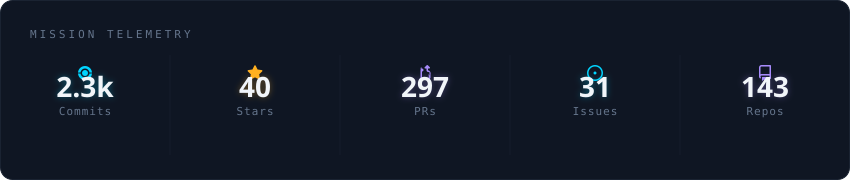

# Hi, I'm Blair Khan 👋

Building innovative solutions with code — I create scalable apps and systems across web and mobile.

- 🌍 Kampala, Uganda
- 🏫 Mountains of the Moon University
- 🔗 Portfolio: https://khanblair.github.io/portfolio/

## GitHub Streak

[](https://git.io/streak-stats)

## 🌌 Galaxy Profile

<div align="center">
  
</div>

<br/>

<div align="center">
  
</div>

<br/>

<div align="center">
  
</div>

<br/>

<div align="center">
  
</div>

<sub>Auto-generated every 12h by <a href="https://github.com/vinimlo/galaxy-profile">galaxy-profile</a> (GPL-3.0), configured in <a href="./config.yml">config.yml</a>.</sub>

## ⏱️ WakaTime Coding Activity

<!--START_SECTION:waka-->


**🐱 My GitHub Data** 

> 📦 1.7 MB Used in GitHub's Storage 
 > 
> 🏆 3,263 Contributions in the Year 2026
 > 
> 💼 Opted to Hire
 > 
> 📜 114 Public Repositories 
 > 
> 🔑 29 Private Repositories 
 > 
**I'm an Early 🐤** 

```text
🌞 Morning                3214 commits        █████░░░░░░░░░░░░░░░░░░░░   19.46 % 
🌆 Daytime                8679 commits        █████████████░░░░░░░░░░░░   52.55 % 
🌃 Evening                3870 commits        ██████░░░░░░░░░░░░░░░░░░░   23.43 % 
🌙 Night                  752 commits         █░░░░░░░░░░░░░░░░░░░░░░░░   04.55 % 
```
📅 **I'm Most Productive on Monday** 

```text
Monday                   4300 commits        ███████░░░░░░░░░░░░░░░░░░   26.04 % 
Tuesday                  2661 commits        ████░░░░░░░░░░░░░░░░░░░░░   16.11 % 
Wednesday                3086 commits        █████░░░░░░░░░░░░░░░░░░░░   18.69 % 
Thursday                 2449 commits        ████░░░░░░░░░░░░░░░░░░░░░   14.83 % 
Friday                   2821 commits        ████░░░░░░░░░░░░░░░░░░░░░   17.08 % 
Saturday                 442 commits         █░░░░░░░░░░░░░░░░░░░░░░░░   02.68 % 
Sunday                   756 commits         █░░░░░░░░░░░░░░░░░░░░░░░░   04.58 % 
```


📊 **This Week I Spent My Time On** 

```text
🕑︎ Time Zone: Africa/Kampala

💬 Programming Languages: 
Other                    13 hrs 24 mins      ████████░░░░░░░░░░░░░░░░░   33.85 % 
TypeScript               11 hrs 36 mins      ███████░░░░░░░░░░░░░░░░░░   29.29 % 
Markdown                 5 hrs 43 mins       ████░░░░░░░░░░░░░░░░░░░░░   14.45 % 
JavaScript               4 hrs 38 mins       ███░░░░░░░░░░░░░░░░░░░░░░   11.69 % 
Go                       1 hr 55 mins        █░░░░░░░░░░░░░░░░░░░░░░░░   04.86 % 

🔥 Editors: 
Claude Code              21 hrs 42 mins      ██████████████░░░░░░░░░░░   54.79 % 
Chrome                   14 hrs 52 mins      █████████░░░░░░░░░░░░░░░░   37.52 % 
VS Code                  1 hr 36 mins        █░░░░░░░░░░░░░░░░░░░░░░░░   04.04 % 
Discord                  54 mins             █░░░░░░░░░░░░░░░░░░░░░░░░   02.30 % 
Hermes                   11 mins             ░░░░░░░░░░░░░░░░░░░░░░░░░   00.47 % 

🐱‍💻 Projects: 
marshal                  10 hrs 7 mins       ██████░░░░░░░░░░░░░░░░░░░   25.54 % 
soundwave                7 hrs 5 mins        ████░░░░░░░░░░░░░░░░░░░░░   17.88 % 
marshal-app              4 hrs 12 mins       ███░░░░░░░░░░░░░░░░░░░░░░   10.63 % 
reelcast                 3 hrs 46 mins       ██░░░░░░░░░░░░░░░░░░░░░░░   09.53 % 
NUNUFUND_ShopPOS         3 hrs 42 mins       ██░░░░░░░░░░░░░░░░░░░░░░░   09.35 % 

💻 Operating System: 
Mac                      39 hrs 38 mins      █████████████████████████   100.00 % 
```

🤖 **AI Coding This Week** 

```text
⏱ AI Coding Time: 16 hrs 25 mins (41.44%)

✍️ 7,487 lines written by AI, 184 lines written by hand (97.6% AI-written)

🔤 19,553,664 Input Tokens, 3,438,652 Output Tokens

💵 $372.44 Estimated AI Cost This Week

🧠 38 AI Sessions, 245 AI Prompts

Sonnet                   7,493 lines         █████████████████████████   99.68 % 
Opus                     24 lines            ░░░░░░░░░░░░░░░░░░░░░░░░░   00.32 % 

🔎 AI Coding Insights:
🤖 AI-Driven — 97.6% of written lines came from AI
📚 Verbose Prompter — average 1,642 characters per prompt
🔁 Iterative Prompter — average 6 prompts per session
🚀 High AI Trust — 2.6% of changed lines were hand-edited
```

**I Mostly Code in TypeScript** 

```text
TypeScript               52 repos            ██████████░░░░░░░░░░░░░░░   39.39 % 
Python                   17 repos            ███░░░░░░░░░░░░░░░░░░░░░░   12.88 % 
HTML                     16 repos            ███░░░░░░░░░░░░░░░░░░░░░░   12.12 % 
Go                       1 repo              ░░░░░░░░░░░░░░░░░░░░░░░░░   00.76 % 
Swift                    1 repo              ░░░░░░░░░░░░░░░░░░░░░░░░░   00.76 % 
```


**Timeline**


 Last Updated on 10/10/2026 05:22:08 UTC
<!--END_SECTION:waka-->

## 📈 Extra WakaTime Insights

<!--START_SECTION:waka-extra-->


🗂️ **My Coding Categories (Last 7 Days)** 

```text
AI Coding                19 hrs 27 mins       ███████████░░░░░░░░░░░░░░   43.07 % 
Browsing                 9 hrs 45 mins        █████░░░░░░░░░░░░░░░░░░░░   21.59 % 
Coding                   9 hrs 34 mins        █████░░░░░░░░░░░░░░░░░░░░   21.20 % 
Code Reviewing           6 hrs 1 min          ███░░░░░░░░░░░░░░░░░░░░░░   13.34 % 
Writing Docs             19 mins              ░░░░░░░░░░░░░░░░░░░░░░░░░   00.72 % 
Writing Tests            2 mins               ░░░░░░░░░░░░░░░░░░░░░░░░░   00.09 % 
```

📚 **Libraries & Dependencies (Last 7 Days)** 

```text
react                    1 hr 37 mins         █░░░░░░░░░░░░░░░░░░░░░░░░   03.33 % 
context                  1 hr 30 mins         █░░░░░░░░░░░░░░░░░░░░░░░░   03.08 % 
time                     1 hr 18 mins         █░░░░░░░░░░░░░░░░░░░░░░░░   02.68 % 
test                     1 hr 17 mins         █░░░░░░░░░░░░░░░░░░░░░░░░   02.64 % 
github.com/khanblair/mar 1 hr 15 mins         █░░░░░░░░░░░░░░░░░░░░░░░░   02.59 % 
strings                  1 hr 13 mins         █░░░░░░░░░░░░░░░░░░░░░░░░   02.50 % 
github.com/khanblair/mar 1 hr 10 mins         █░░░░░░░░░░░░░░░░░░░░░░░░   02.42 % 
github.com/khanblair/mar 1 hr 8 mins          █░░░░░░░░░░░░░░░░░░░░░░░░   02.35 % 
```

💻 **Machines (Last 7 Days)** 

```text
Kolaborates-MacBook-Air. 45 hrs 11 mins       █████████████████████████   100.00 % 
```

<!--END_SECTION:waka-extra-->
